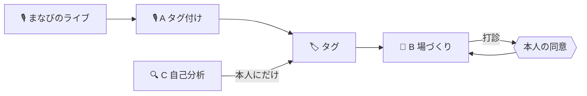

# 社内勉強会の幹事をAIエージェントに任せた — まなびのわ / AI HACK 2026

## 概要

- 社内のもくもく会を録って知見カードにする → 興味が集まったらAIが場を立てる、を回すサービスです
- 口を持つ（人に話しかけられる）のはエージェント3体のうち1体だけ、という権限設計にしました
- ルーターを絞って固定しただけで、知見抽出1回あたりの費用が $0.037454 → $0.000850（約97.7%減、約44分の1）になりました

## はじめに

はじめまして。チームFの小室と岩田です。

実は、AIエージェントを作るのは2人とも初めての挑戦です。RLSも、Named Routerも、Supabaseの外部キー制約でここまで防御できることも、作りながら知りました。GitHubの使い方や設計の壁打ちはClaudeに相談しながら進め、5日間のうち**何を作らないかを先に決める**ことから始めました。ここから先で出てくる実装の工夫は、初心者2人が5日間で「作りながら知った」ことばかりです。

私たち2人は、それぞれ別の勉強コミュニティを運営しています。小室はいろんな人にいろんなことを教えてもらいながら生きてきて、教えてくれた人たちと会えなくなってしまうこともありました。だからこそ、知識を共有する仕組みを広めることが、巡り巡ってその人たちの力になったらいいなとずっと考えていました。岩田は、日頃から「学ぶことを、もっといい形で広めたい」と思いながら勉強会を運営してきた一人です。

AI HACK 2026のテーマ「業務を自律化するAIエージェント」に取り組む際、そんな2人の関心がちょうど重なったのが「勉強会の幹事」という仕事でした。

## 知識のいきどまり

勉強会を開くだけでは、知識は必要な人に届きません。その回に参加できなかった人には話の内容は伝わらず、せっかく話された知見もその場にいた数人の記憶に残るだけで終わってしまいます。社員が何を知りたがっているのか、逆に誰が答えを持っているのかは、そもそも誰にも見えていません。だから「今度この人を呼んで話してもらおう」という次の一手も生まれません。

似た課題を解決しようとするツールに、社員のスキルや資格を登録するデータベース型のサービスもあります。ただ、それはあくまでデータが貯まるだけの場所です。誰が何を知っているかを記録することはできても、それを見て実際に人と人を引き合わせるところまでは面倒を見てくれません。**知識は記録されても、人と人はつながらない**のです。

学びの輪が解きたいのはここです。知っている人と知りたい人を、AIが見つけて実際につなげる。既存のナレッジ管理が「書いたものを人が探しに行く」のに対して、これは**「喋ったことが人を呼び集めに行く」**という発想です。

## はなしてつながる「まなびのわ」

そんな課題を解決するのがまなびのわです。

まなびのわは、

```
集まる（もくもく会）→ 残る（知見カードが溜まる）→ 知る（人にタグが付く）→ つながる（AIが場を立てる）→ また集まる
```

この4つの輪を回し続けるプロダクトです。

- **集まる**：もくもく会（まなびのライブ）を開く。特別な準備はいらず、いつも通り作業しながら雑談するだけです
- **残る**：ライブが終わると、タグ付けエージェントAが会話から知見カードを切り出します。誰が何を知っていて、誰が何を知りたがっていたかが、雑談のまま消えずに初めて記録として残ります
- **知る**：知見カードにタグが付き、「知見タグ」（詳しい）と「興味タグ」（知りたい）として人に結びつきます。1回の雑談では気づかれなかった「実はこの人、これに詳しい」が、タグという形で見えるようになります
- **つながる**：タグが溜まると、場づくりエージェントBが「もう一度集まる価値があるか」を判断し、価値があると判断したら詳しい人に声をかけて次のライブを立てます
- **また集まる**：立った場がまた新しいもくもく会になり、輪が一周します

普通のナレッジ管理ツールは「集まる → 残る」で止まります。**知る・つながるまでを自動でやる**のが、まなびのわの独自性です。

## 知識のたまるもくもく会「まなびのライブ」

「まなびのライブ」はもくもく会の様子を音声ライブとして配信する機能です。インスタライブやXのスペースに近い形式で、必ず始まりと終わりがあります。

| 役割 | できること |
|---|---|
| 🎤 スピーカー | 音声で話す。知見を持っている側 |
| 💬 リスナー | 聞くだけでいい。コメントで口を出せる |

**聞くだけの参加を正式な席として用意している**のが肝です。「喋らないと気まずい」がなくなると、知識はあるのに前に出にくい人の話が出てきます。

**必ず始まりと終わりがある**ことにも意味があります。常時録音するツールと違い、「このライブで語られたこと」という区切りがはっきりするので、タグ付けエージェントが1回のライブ単位で知見を切り出せます。ライブがだらだら続く録音データではなく、始まりと終わりのある1つのまとまりとして扱えるのが大事なポイントです。

リスナーのコメントも、ただの雑談として消えません。どの話題にコメントで食いついたかは、**その人の「興味タグ」の材料**になります。スピーカーとして詳しい話をすれば知見タグが、リスナーとして関心を示せば興味タグが、それぞれ自動で付いていきます。

## 興味と知識がのこる「タグ」

タグには2種類あります。**知見タグ**（詳しい人に付く）と**興味タグ**（知りたい人に付く）です。同じ「生成AI活用」というタグでも、知見タグとして持っている人は「語れる人」、興味タグとして持っている人は「聞きたい人」を意味します。呼び方をあえて「ラベル」ではなく「タグ」にしているのも、この2種類を区別するためです。

付き方も違います。知見タグは、まなびのライブでスピーカーとして詳しい話をしたときに付きます。興味タグは、リスナーとしてコメントで食いついたときや、自己分析エージェントCが本人の作業画面から拾い上げたとき（本人にしか見えない状態で）に付きます。話した実績と、知りたがった実績を、それぞれ別のタグとして積み上げていく仕組みです。

この2種類のタグこそが、場づくりエージェントBの判断材料そのものです。ある話題の**興味タグを持つ人が増えてきた**タイミングで、Bは同じ話題の**知見タグを持つ人**を相談役の候補として探し、打診します。「聞きたい人が何人か溜まってきたから、詳しい人に声をかける」という、勉強会の幹事が頭の中でやっていたマッチングを、タグの重なりだけで自動的に再現しているのがこの仕組みです。

なお、1人が同じ話題に知見タグと興味タグの両方を持つこともあります。詳しい話題でも、もっと深く知りたいと思えば興味タグも付く——**知っていることと、知りたいことは矛盾しない**という前提で設計しています。


## ひとをつなげる「エージェント」



| | 🎙️A タグ付け | 🎪B 場づくり | 🔍C 自己分析 |
|---|---|---|---|
| 起動 | ライブが終わったら | 1日1回 自分で | 本人がボタンを押したら |
| 人に喋る | できない | できる | できない |
| APIキー | 通知権限なし | 通知あり・予算あり | vision用 |

通知を送る権限は**Bのキーにしか渡していません**。Aが乗っ取られても、外に出ていくものがありません。機能ではなく**権限**を分けています。
### AIにさせないこと

- 会話の書き起こし本文を全社公開しない（要約したカードだけ出す）
- AIがタグを勝手に「正式」にしない
- その場にいなかった人の発言として記録することはできない（DBの外部キーで拒否されます）

### 🎙️A タグ付けエージェント — 判断はしない、拾うだけ

トリガーはライブが終わった瞬間（`lives.ingest_status = 'pending'`）です。読むのは文字起こしと、AIの発言を除いたリスナーのコメントだけ。

やることは4つです。

1. 知見カードを切り出す。**発言をそのまま引用せず、必ず要約します**（カードは全社公開されるため）
2. タグを決める。三重の門（形・固有名詞・表記ゆれ）を通ったものだけを候補として辞書に登録する
3. 話者はLLMに教えません。渡すのは行番号`[s12]`だけで、LLMは名前も`user_id`も扱えない設計です。渡していない行番号を指したら、そのライブは`done`にはせず`needs_review`で止めて人に戻します
4. 語られるたびに`tag_mentions`に記録し、直近30日で延べ3回または2人以上語られたタグを「格上げ候補」にします。ただし**AI自身は正式化しません**。正式にできるのは承認した管理者だけです

コストの方針は「まず無料モデルで足切りし、残った発言だけ強いモデルに回す」。判断が難しいものだけ一段階上のモデルに上げる階段構造です。

### 🎪B 場づくりエージェント — この製品の心臓

トリガーは1日1回のCronに加えて、進行中の「企て」があるたびに毎回様子を見に行きます。やることは9ステップです。

進行中の企てを全部見て次の一手を決める → 新しく立てる価値のあるタグを探す → 「立てるか」を毎回判断する → 相談役の候補をコードで作る（LLMは絞り込まれた候補から選ぶだけ） → 打診する → OKが出たら予定を見て日程を決める（空き/埋まりだけ） → ライブを予約して最初の一言を書く → 誰も喋っていなければ呼び水を投げる → 企てを閉じて結果を残す

判断材料はタグが付いた人数だけではありません。前回からの間隔、顔ぶれの入れ替わり（前回の興味者リストとの差分）、この1週間で新しく興味タグが付いた人数、前回の反応（参加人数・コメント数・生まれた知見カード数）、「またやりたい」と言われた回数（アンコール）、相談役の負担（直近の打診数）——この7つをLLMに渡して判断させます。

一方で、暴走を防ぐハードリミットはLLMに一切渡さずコードで持っています。前回終了から14日は絶対に立てない、同じ人への打診は週2回まで、候補3人に断られたら管理者へエスカレーション、1つの企てが14日動かなければ諦める。判断の自由度と、止まる保証を明確に分けています。

### 🔍C 自己分析エージェント — 見せるのは本人にだけ

本人がボタンを押したときだけ動きます。ブラウザの画面共有APIで共有範囲は本人がOSダイアログで選び、開始時に終了時刻を自分で宣言します。数分おきに静止画を1枚取り、前の1枚とほぼ同じなら捨て、終了時にまとめて1回だけモデルに渡してタグ候補を出します。

出てきたタグ候補は最初から`visibility='private'`で`user_tags`に入り、**本人にしか見えません**。「採用する」という操作は、新しいテーブルを作らず、`visibility`を`private`から`public`に切り替えるだけです。**画像は一切保存しません**。DBに画像を持つ列自体がなく、ログにも出しません。

## Bは「立てない」を選べる

Bは閾値では動きません。毎回こう判断します。

```json
{ "decision": "open" | "wait" | "skip", "confidence": 0.78, "reason": "..." }
```

`wait`（まだ）を選べるのが重要です。2値だとAIは必ずどちらかに倒れます。判断材料は前回からの間隔・顔ぶれの入れ替わり・前回の反応・「またやりたい」と言われたか（アンコール）・相談役の負担で、**「立てなかった」という判断も理由つきで記録されます**。1回で終わらず、打診して断られて探し直して日程を決めて立てて、沈黙したら呼び水を投げる——日をまたいで1つのゴールを追い続けます。その進行状態を「企て」として持っています。

## 名前で照合するのをやめた

正直に書きます。最初の実装は、話者の名前を文字列で社員名簿と照合していました。その結果、**「星野陸」と「星野 陸」を別人と判断し、社員アカウントを勝手に4つ作ってしまいました。** 直そうとして気づいたのは、もっと悪い事実でした。文字起こしに1行書き足すだけで、**他人の名義でタグが作れてしまう**ということです。

ライブには参加者が各自のアカウントで入るので、音声が出た瞬間に誰の声かはもう確定しています。名前で照合し直す必要すらありません。文字起こしを最初から`user_id`付きの行で持つ形に直すと、照合ロジックがまるごと消えました。

```sql
foreign key (live_id, user_id) references live_participants(live_id, user_id)
```

この設計を実際に試しました。参加していない社員の`user_id`で`transcript_segments`へ直接INSERTを試したところ、アプリのコードを一切通さなくても、次のエラーでその場で拒否されました。

```json
{
  "code": "23503",
  "message": "insert or update on table \"transcript_segments\" violates foreign key constraint \"transcript_segments_live_id_user_id_fkey\""
}
```

RLSを素通りする`service_role`で直接SQLを打っても、です。つまり「スクリプトが賢く弾いた」のではなく、**データベースの構造そのものが弾いています**。さらにLLMには**行番号だけ**を見せ、渡していない行番号を返したらそのカードごと捨てて人に返す設計にしているので、AIは人を推測しません。

## 伏せるものと止めるもの

エージェント3体はそれぞれスコープ付きAPIキーを1本ずつ持ち、予算上限と有効期限が付いています。この3本のキーにだけ、ガードレール`manabi-pii`を明示的に紐づけました。

| 対象 | 動き |
|---|---|
| メール・電話・APIキー（`sk-orca-`）・JWT・AWSキー | **マスクして続行**（ライブでうっかり読み上げても取り込みは止めない） |
| クレジットカード番号 | **ブロック**（勉強会の会話に出る理由が無い。入力側で止まるので課金なし） |

PII Shieldの既定は「マスク」で、氏名・住所・社名は既定では検出対象外です。ただ、うちはそもそも**文字起こしに名前を流さない設計**（前節）にしたので、氏名用のカスタムルールは足していません。

## autoをやめて測って決めた

タグ付けエージェントAのモデル指定を`orcarouter/auto`（全モデルが候補）から、Named Router `manabi-recorder`（フロンティア級には上がらない候補だけで構成）に切り替え、**同じ3本のデモ文字起こしを同じ内容のまま**再実行して比較しました。

| | 合計費用 | 選ばれたモデルの傾向 |
|---|---|---|
| before（auto） | $0.037454 | 都度違う（1回は高価な`-pro`系まで上振れ） |
| after（manabi-recorder） | $0.000850 | 毎回同じ安いモデルで安定 |

**約97.7%削減（約44分の1）**。「削った」のではなく「測って出せる」根拠がRequest Logsに残っています。

## 安くしたら育ちかけの知識が捨てられていた

切り替えた直後、3本の抽出タグが辞書の正式名と一致しなくなり、門1（表記チェック）で候補の多くが落ちました。原因は「安いモデルだから」ではなく、**正式タグの一覧をLLMに渡していなかった実装の穴**でした。安いモデルほど、辞書にない言い回しに寄りやすかったのです。正式タグ一覧を毎回参照させるよう直したところ、同じ3本の再実行で表記ゆれによる取りこぼしは0件になりました。コストと抽出品質を混同して「安ければいい」と即断しなかった、という失敗談です。

## 壊して直す

幹事エージェントBの1周分の処理を、実書き込みで2回連続実行しました。1回目で2つのタグがopenになり打診まで進みます。まったく同じコマンドをもう一度流すと、進行中の企てはそのまま「次の一手」に回り、新規タグ判定の対象からは自動的に除外されました。

```sql
create unique index quests_one_active_per_tag
  on quests (tag_id)
  where status in ('scouting','inviting','scheduling','opened');
```

DB側の部分ユニークインデックスと、コード側の除外ロジックの二重防御で、**同じタグの場が二重に立つことはありません**。停止条件（14日連続不開催で断念、打診は週2回まで、候補3人に断られたらエスカレーション、コスト上限）もすべてLLMの出力を待たずコード側で判定しており、LLMがどんな出力をしてもこの条件そのものは動かせません。

## 任せるところと任せないところ

人が介在するのは、意図的に絞ったこの4か所だけです。

| | ゲート | 誰が |
|---|---|---|
| 1 | 相談役への打診に答える | 打診された本人 |
| 2 | タグの格上げを承認する | 管理者 |
| 3 | 話者を確定できない取り込みを確認する | 管理者 |
| 4 | 例外エスカレーションを受ける | 管理者 |

管理者に渡したのは**全社の語彙を決める承認**だけです。**場を立てる承認権**は渡していません。タグが正式になっていなくても興味が重なっていれば場は立ちますし、管理者が見ていない週末でも止まりません。

## OrcaRouterをどう使ったか

モデル名はコードに書きません。エージェントごとにNamed Routerを1本ずつ作り、振り分けを任せています。

| ルーター | 使うエージェント | 考え方 |
|---|---|---|
| `manabi-recorder` | 🎙️A | 簡単な塊は無料・安いモデル、難しい塊だけ一段上へ。フロンティア級には上がらない |
| `manabi-organizer` | 🎪B | 中位の2本。候補選びはコードがやるので最上位は要らない |
| `manabi-mirror` | 🔍C | 画像を読めるモデルだけ |

候補は**構造化出力に対応したモデルだけ**で組んでいます（3体ともJSONで受けるため）。

## だれに売るのか、いくらで

狙うのは、社員300〜3,000人規模で「学び合う文化」はあるのに仕組みがない企業の人材育成・情報システム部門です。特にエンジニア組織・コンサル・SIerのような、暗黙知が資産になる業種を最初の顧客像に置いています。Qiita TeamやKibela、Notionのような既存の情報共有ツールは「書いたものを人が検索しに行く」設計で、私たちの「喋ったことが人を呼び集める」体験とは競合ではなく併用先だと考えています。

価格は、アクティブな参加アカウント数に応じた月額SaaSを想定しています（あくまで初期仮説です）。

| プラン | 対象規模 | 月額目安 |
|---|---|---|
| スモール | 〜100人 | ¥50,000 |
| ミドル | 〜500人 | ¥200,000 |
| エンタープライズ | 500人〜 | 個別見積もり |

1人あたりに直すと月¥400〜500程度で、社内チャットツールの追加アプリ1本分の感覚です。ROIの説明は単純で、勉強会を1回立てるのに人材育成担当が使っている**テーマ決め・人探し・声かけ・日程調整・告知**の工数（体感30分〜1時間）を、月の開催数だけ人の手から外せます。実際の支払い意欲や規模別の価格感度はまだ検証できていないので、ここは今後ヒアリングで裏取りしたい部分です。

## 穴の位置と これから育てたいこと

マルチテナント分離・キーの完全分離・カレンダー実連携・ライブ中のリアルタイム解析・定期開催の設定画面は、設計としては決めたうえで今回は実装していません。カレンダーは実運用でも空き/仮/予定あり/外出中の状態だけを見る設計にし、予定のタイトルも参加者も最初から取りに行きません。穴がないふりはせず、場だから後から育てられる、という考え方で今回のスコープを決めています。知識地図・スキルシート・知見ビュー・勉強部屋は「こういうこともできます」の将来像として設計だけ残しています。

## まとめとリンク

- リポジトリ：https://github.com/Komuro-524/manabi-no-wa
- 設計の正：`DESIGN.md`
- 証拠：`docs/evidence/`
- `#AIHACK` `#OrcaRouter`
